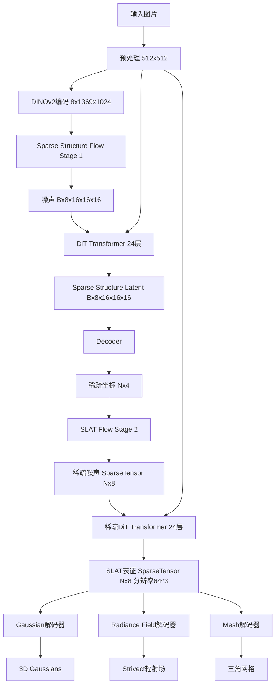

# 3D 生成模型发展
## 纯 3D 重建
纯 3D 重建的意思是只能将物理世界已经存在的实物转成 3D 资产
- [NeRF](https://github.com/real-zhangzhe/3D/blob/main/1_3D%E7%94%9F%E6%88%90/1_3D%E8%A1%A8%E7%A4%BA%E6%96%B9%E6%B3%95.md#2-%E7%A5%9E%E7%BB%8F%E8%BE%90%E5%B0%84%E5%9C%BA-neural-radiance-fields-nerf)
- [3DGS](https://github.com/real-zhangzhe/3D/blob/main/1_3D%E7%94%9F%E6%88%90/1_3D%E8%A1%A8%E7%A4%BA%E6%96%B9%E6%B3%95.md#4-3d-%E9%AB%98%E6%96%AF%E6%BA%85%E5%B0%84-3d-gaussian-splatting-3dgs)
## 基于大模型的 3D 生成
以 Hunyuan3D 为例，Hunyuan3D 共有三个大版本，1.0 / 2.0 / omni
- [hunyuan3D 1.0](https://arxiv.org/pdf/2411.02293)
- [hunyuan3D 2.0](https://arxiv.org/pdf/2501.12202)
- [hunyuan3D Omni](https://arxiv.org/pdf/2509.21245)
- 进化脉络总览
  - **Hunyuan3D 1.0**: 采用“多视角生成 + 稀疏视图重建”的两阶段方案，本质上是一个 2D 提升 (2D-Lifting) 框架，通过强大的2D扩散模型生成中间图像，再重建为3D模型。
  - **Hunyuan3D 2.0**: 架构发生根本性变革，转向 原生3D生成 (3D-Native) 框架。它直接在3D数据的潜在空间中进行扩散生成，分为“形状生成”和“纹理生成”两个独立的阶段，标志着技术路线的重大升级。
  - **Hunyuan3D-Omni**: 在2.0的强大原生3D生成能力基础上，增加了精细化、多模态的控制能力。它通过一个统一的控制器，接受点云、骨骼、体素等多种几何先验信息，实现了对生成结果的精准操控。

| 特性 | Hunyuan3D 1.0 | Hunyuan3D 2.0| Hunyuan3D-Omni |
| :--- | :--- | :--- | :--- |
| 核心范式 | 2D提升 (2D-Lifting) | 原生3D生成 (3D-Native) | 可控原生3D生成 |
| 主要输入 | 单张图片 / 文本 | 单张图片 | 图片 + 控制信号 (点云/体素/边界框/骨骼) |
| 主要输出 | 3D网格 | 带 PBR材质 的纹理化3D网格 | 符合控制条件的3D网格 |
| 阶段一 | 多视角图像生成 | 形状生成 (Shape Generation) | 形状生成 (集成控制信号) |
| 阶段二 | 稀疏视图3D重建 | 纹理合成 (Texture Synthesis) | (继承2.0的纹理合成能力) |
| 关键技术 | 混合输入、0度仰角轨道 | ShapeVAE、重要性采样、DiT、Paint模型、去光照 | 统一控制编码器 (Unified Control Encoder) |
|是否开源|是|是|是|
|参数量|7.18B|未查到|3.3B|
| 进化方向 | 提高生成速度和泛化性 | 提升模型原生3D能力和输出质量 | 增加生成过程的可控性和精确度 |
### Hunyuan3D 1.0（2D-Lifting 框架）

- 开源，参数量 7.18B
- 核心功能：一个统一的框架，支持从文本或单张图片生成3D资产，旨在实现速度与质量的平衡。
- 输入与输出
  - 输入: 单一文本提示或单张图片。
  - 输出: 带有UV贴图的3D网格模型，可以直接被艺术家使用。
- 模型阶段与流程：一个明确的两阶段流水线。
  - 第一阶段：多视角扩散模型 (Multi-view Diffusion)
    - 输入: 条件图片或文本提示。
    - 功能: 利用一个微调后的大型2D扩散模型（如Hunyuan-DiT），高效地生成一组（例如6张）围绕物体的、视角一致的RGB图像。
    - 输出: 一组多视角RGB图像。
  - 第二阶段：稀疏视图重建模型 (Sparse-view Reconstruction)
    - 输入: 第一阶段生成的多视角图像，以及作为辅助信息的 原始条件图片（这被称为“混合输入”，是其创新点之一）。
    - 功能: 一个前馈式的Transformer模型，接收带有已知相机位姿的多视角图像和无位姿信息的条件图像，快速重建出3D形状。
    - 输出: 3D模型。模型内部使用符号距离函数（SDF）表示，并通过移动立方体算法（Marching Cubes）转换为显式的网格模型。
- 训练数据构造
  - 来源: 使用了类似于 [Objaverse-xl（开源，1000 万个 3D 物体，每条数据主要包含两个模态的信息：文本（这个物体是什么），3D（形状和纹理））](https://huggingface.co/datasets/allenai/objaverse-xl) 的大规模内部数据集。数据经过筛选，移除了复杂场景或劣质模型。
  - 条件图渲染: 相机位姿随机采样（例如，仰角在[-20°, 60°]之间），并使用随机的HDR环境光。
  - 目标多视角图渲染: 为了最大化生成视图间的可见区域，相机被固定在 0度仰角 的轨道上，并沿方位角均匀采样（如0°, 60°, 120°...）。
### Hunyuan3D 2.0  (原生3D生成框架)

- 开源，参数量没有查到。
- 核心功能：一个先进的大规模3D合成系统，可从单张图片生成高分辨率、带PBR（基于物理的渲染）材质的纹理化3D资产。
- 输入与输出
  - 输入: 单张图片。
  - 输出: 高保真度的3D网格，以及一套PBR材质贴图（如反照率Albedo、金属度Metallic、粗糙度Roughness）。
- 模型阶段与流程：同样是两阶段，但阶段的定义与1.0完全不同，解耦了形状和纹理的生成。
  - 第一阶段：形状生成 (Shape Generation - Hunyuan3D-DiT) 此阶段本身包含两个核心组件：
      - Hunyuan3D-ShapeVAE (自编码器): 这是一个预训练模型，用于将3D网格数据压缩成紧凑的潜在空间表征（一系列连续的tokens）。其关键创新是除了均匀采样，还引入了表面重要性采样，在模型的边和角等细节丰富区域采集更多点，以更好地捕捉几何细节。
      - Hunyuan3D-DiT (扩散模型):
        - 输入: 单张图片。
        - 功能: 一个基于流匹配（Flow-based）的扩散Transformer模型，它在ShapeVAE构建的潜在空间中进行操作，根据输入图片预测出代表3D形状的潜在tokens序列。
        - 输出: 潜在tokens序列。该序列随后被送入ShapeVAE的解码器，解码成最终的3D网格。
  - 第二阶段：纹理合成 (Texture Synthesis - Hunyuan3D-Paint)
    - 输入: 第一阶段生成的无纹理网格，以及原始的条件图片。
    - 功能: 一个以网格为条件的多视角图像生成模型。它首先从输入网格渲染出法线图、坐标图等几何先验信息，然后结合条件图片，生成一组在多个视角下都与几何体对齐且相互一致的图像。该模型还包含一个图像去光照 (Image Delighting) 模块，用于消除输入图片中的光影，以生成与光照无关的纹理。
    - 输出: 一张高分辨率、无缝的PBR纹理贴图。这是通过将生成的多视角图像“烘焙”(Baking)到网格的UV上实现的。
- 训练数据构造
  - 形状数据: 约10万个来自公共数据集（如ShapeNet, Objaverse）的3D模型。预处理流程非常精细，包括归一化、水密化处理 (Watertight)、SDF采样、混合表面采样等步骤。
  - 纹理数据: 约7万个从Objaverse-XL中筛选出的高质量、经人工标注的3D模型。为每个模型从多个角度渲染PBR贴图（反照率、金属度、粗糙度）作为训练目标。
### Hunyuan3D-Omni (可控原生3D生成框架)

- 开源，参数量 3.3B
- 核心功能：在Hunyuan3D 2.0的基础上构建的统一框架，用于实现精细化、可控的3D资产生成。
- 输入与输出
  - 输入: 多模态输入，包括一张基础图片 加上 一种额外的控制信号。支持的控制信号有：
    - 点云 (Point Cloud) 
    - 体素 (Voxel) 
    - 边界框 (Bounding Box) 
    - 骨骼姿态 (Skeleton) 
  - 输出: 一个在几何、拓扑或姿态上同时遵循图片内容和额外控制信号的3D网格。
- 模型阶段与流程
  - 模型的主体架构继承自Hunyuan3D 2.0（DiT + VAE解码器），其核心创新在于如何将控制信号融入生成过程。
  - 新增模块：统一控制编码器 (Unified Control Encoder)
  - 输入: 上述四种控制信号中的一种。
  - 功能: 这是一个轻量级的共享编码器。它的设计巧妙之处在于，将所有控制信号都统一表示为点云形式（例如，边界框的8个顶点、骨骼的关节点、体素的中心点）。编码器处理这些“点云”并提取其特征。同时，模型还使用一个任务嵌入（Task Embedding）来区分当前输入的是哪种类型的控制，避免混淆。
  - 输出: 控制信号的特征嵌入 (feature embedding)。
- 特征融合与生成：从“统一控制编码器”输出的特征嵌入，会与从输入图片中提取的DINO特征进行拼接 (concatenate)。这个融合后的特征向量作为最终的条件，被送入Hunyuan3D-DiT模型中，引导扩散过程生成符合所有条件的3D形状潜在tokens。后续流程与2.0一致，通过VAE解码器得到最终网格。
- 训练数据构造
  - 来源: 基于Hunyuan3D 2.0的数据集。
  - 控制信号构造: 在训练时，从原始的3D模型中提取或生成相应的控制信号。例如，从模型表面采样点云，计算其边界框，或从带骨骼的动画角色中提取某一帧的骨骼和对应的网格。
  - 训练策略: 采用了一种“难度感知采样策略”，在训练中会更频繁地采样像姿态控制这样比较难学习的任务，以保证模型能稳健地掌握所有控制能力。
### TRELLIS
- paper: https://arxiv.org/pdf/2412.01506
- code: https://github.com/Microsoft/TRELLIS
- model: https://huggingface.co/microsoft/TRELLIS-text-xlarge
- 提出了一种Structured LATent（SLAT）：把 3D 物体表示为“稀疏的体素格上挂局部 latent 向量”的统一表征，结合强大的视觉特征（DINOv2），并用两阶段的 rectified-flow transformer 来生成结构与局部 latent，从而可以解码为不同的 3D 输出格式（3D Gaussian、Radiance Field、mesh 等），实现高质量、可编辑且格式多样的 3D 资产生成。
- SLAT 的具体定义
SLAT (Structured Latent) 是TRELLIS中的核心中间表征，具有以下特点：
  - 数据结构：稀疏张量 (SparseTensor)
    - coords: 整数坐标 (N, 4) int32 - [batch, x, y, z]
    - feats: 浮点特征 (N, 8) float32 - 8通道特征向量
  - 空间分辨率：64³ 体素空间
  - 特征维度：8通道，经过标准化
  - 稀疏性：仅在非空体素位置存储特征，典型占用率 < 5%
  - 统一性：同一个SLAT可以解码为Gaussian、Radiance Field、Mesh三种格式

> 上面表示训练过程，下面表示推理过程

#### 1. 训练过程
##### 0. 数据准备与多视角特征提取
- 输入：
  - 3D 资产模型（mesh 或 point cloud）
  - 渲染器生成的多视角 RGB 图像（约 150 views）
  - 每张图的相机姿态（R, t, intrinsics）
- 过程：
  - 使用预训练视觉模型 DINOv2 提取每张图的 patch-level 特征（每张图被切成 37x37 个 patch，每个 patch 提取成 1024 长度的特征向量）；
  - 将 3D 资产 voxel 化（64 x 64 x 64 分辨率）
  - 体素稀疏化，只保留表面区域激活体素，平均每个样本保留 20k 左右的体素；
  - 通过已知相机位姿把这些特征反投影到 3D voxel grid；
  - 在每个 voxel 聚合多视角特征（平均 / max pooling）→ 得到 voxel feature grid f(x, y, z)；
- 输出：
  - 稀疏 3D 特征 (pi, fi) 组成的序列（active voxels），pi 表示体素 i 的位置坐标，fi 表示体素 i 的特征向量
##### 1. 训练稀疏结构生成模型 SparseStructureFlowModel
- 输入：
  名称|	Shape|	含义
  ---|---|---
  noise|	(B, 8, 16, 16, 16)|	初始高斯噪声
  image_feats|	(B, 1369, 1024)|	DINOv2 提取的图像特征
  t|	(B,)	|flow matching 时间步
- 输出：
  名称|	Shape|	含义
  ---|---|---
  latent|(B, 8, 16, 16, 16)|生成的体素 latent
  occupancy|(B, 1, 16, 16, 16)|occupancy 概率 (经解码器预测)
- 监督信号：监督目标来自 ground-truth occupancy grids（稀疏体素结构），根据 3d 资产可以得到（64 下采样到 16）。
##### 2. 训练 SLAT 核心生成 (ElasticSLatFlowModel)
- 输入：
  输入|	说明
  ---|---
  Sparse coords|	Stage 1 输出的非空体素坐标
  Sparse feats|	随机噪声特征 (8维)
  Image feats|	DINOv2 图像特征
  t	|时间步，用于 flow matching
- 输出：
  输出	|Shape|	含义
  ---|---|---
  SLAT coords|	(N_voxels, 4)	|稀疏坐标 (batch,x,y,z)
  SLAT feats|	(N_voxels, 8)	|稀疏latent特征
- 监督信号（SLAT 表征无法直接监督，需要 decode 为 3D 才可以）：
  - 多视图渲染监督
    - 对每个 3D 资产有多视角图像
    - SLAT → 解码为 NeRF / Gaussian → 渲染成图像
    - 与真实视图计算重建损失
  - 几何一致性监督：SLAT → 解码为 mesh / occupancy → 与真实 mesh 计算 Chamfer 距离
  - 稀疏特征正则化：约束 latent 特征的分布，促进稀疏性和稳定性
##### 3. 训练多格式解码器
- SLAT 是统一稀疏latent。论文中提到它可被解码为三种不同的 3D 资产类型：Gaussian / Radiance Field / Mesh。
- 这三个解码器各自独立训练，共享同一 SLAT latent 空间。
#### 2. 推理过程

##### 阶段 0: 图像预处理
- 功能：去除背景、裁剪、归一化
- 输入：原始PIL图像（任意尺寸）
- 输出：**518×518 RGB图像，带alpha通道**
- 处理步骤：
  - 使用 rembg (U2-Net) 去除背景
  - 根据前景内容裁剪并居中
  - 调整大小到 518×518
##### 阶段 1: 图像条件编码
- 模型：DINOv2 ViT-L/14-reg
- 输入：(B, 3, 518, 518) - 预处理后的图像
- 输出：**(B, N, 1024)** - 图像特征tokens，其中 N = (518/14)² = 1369（37 x 37）
- 处理：通过 DINOv2 提取 patch tokens
##### 阶段 2: 稀疏结构生成 (Stage 1)
- 模型：SparseStructureFlowModel（DiT）
- 输入：
  - Noise: (B, 8, 16, 16, 16) - 3D噪声张量
  - Image condition: (B, 1369, 1024) - DINOv2特征
  - Timestep: (B,) - Flow matching时间步
- 处理流程：
  - 将3D噪声 patchify（如果patch_size>1）
  - 添加3D位置编码
  - 通过24层 DiT transformer blocks，进行图像条件的交叉注意力
  - Unpatchify 回3D体积
- 输出：(B, 8, 16, 16, 16) - 稀疏结构latent
- 解码到坐标：
  - 通过 SparseStructureDecoder 解码为occupancy grid
  - Resolution: 16³
  - 提取 occupancy > 0 的体素坐标
- 解码器输出：(B, 1, 16, 16, 16) - occupancy概率
- 提取坐标：**(N_occupied, 4)** - [batch_idx, x, y, z]，其中 N_occupied 是非空体素数量
##### 阶段 3: SLAT 生成 (Stage 2) - 核心表征
- 模型：ElasticSLatFlowModel
- 输入：
  - Sparse noise: SparseTensor
  - coords: (N_voxels, 4) - 从Stage 1得到的坐标
  - feats: (N_voxels, 8) - 随机噪声特征
  - Image condition: (B, 1369, 1024) - DINOv2特征
  - Timestep: (B,) - Flow matching时间步
- 处理流程：
  - 通过sparse linear层和下采样ResBlocks处理输入 (2倍下采样)
  - 添加稀疏3D位置编码
  - 通过24层稀疏DiT transformer blocks，带图像交叉注意力
  - 通过上采样ResBlocks和skip connections恢复分辨率
  - 输出层产生8通道特征
- 输出 - SLAT表征：**SparseTensor**
  - coords: (N_voxels, 4) - [batch_idx, x, y, z]，坐标在64³空间
  - feats: (N_voxels, 8) - 8通道特征，应用归一化
##### 阶段 4: SLAT 解码到多种3D表征
- SLAT (Structured Latent) 是TRELLIS的统一3D表征，以稀疏张量格式存储，可以解码为三种不同的3D资产格式：
  - Gaussian Splatting 解码
  - Radiance Field 解码
  - Mesh 解码
#### 3. 资源投入
- 数据：
  - 论文中提到 3D 训练数据都是开源数据，整理 + 清洗干净的 500K 个高质量 3D 资产也都开源了，image captioning 用的 GPT-4o
- 算力：
  - 论文提到训练使用了 64 卡 A100（40GB）资源训练模型
  - 最大尺寸模型 2B 参数，如果需要做 SFT，那 16 卡 A100（40GB）就足够了
- 训练：开源代码库中不仅包含了模型 inference 代码，也包含了开源数据下载方式和训练代码，可以直接使用。
### CLAY
- paper: https://arxiv.org/pdf/2406.13897
- 闭源商业模型，产品主页：https://hyper3d.ai/
- 实际测试效果：

- CLAY 的目标：将文本、图片、或其他 3D 条件（点云、体素、bounding box、隐式场等）直接转化为高质量、可物理渲染的 3D 资产（geometry + PBR 材质）
- 整体结构：
  - Geometry Generation 模块
    - 输入：文本 / 图像 / 3D 控制（点云、体素等）
    - 模型：基于 VAE + DiT 的 3D 潜空间扩散生成模型
    - 输出：3D 占据场（occupancy field）→ 转为网格（mesh）
  - Material Generation 模块
    - 输入：生成的 mesh + 多视角渲染条件
    - 模型：Multi-view Material Diffusion（多视角纹理扩散模型）
    - 输出：PBR 材质贴图（Diffuse, Roughness, Metallic，2K 分辨率）
  - Adaptation & Control 模块
    - 提供多模态控制接口：文本、图片、体素、点云、多视图、bounding box 等
    - 支持 LoRA 微调与 cross-attention 控制，实现风格化与条件生成
#### 1. 几何生成模块

- 训练数据：构建了统一标准的 3D 数据集（≈52.7 万件模型），整合自 ShapeNet + Objaverse

##### a. VAE encoder
- 输入： 从 mesh 表面采样的点云 X ∈ ℝ^{N×3}，多分辨率点云采样：N ∈ {2048, 4096, 8192}
- 模型： Transformer-based VAE Encoder
- 输出：潜变量 Z ∈ ℝ^{L×64}，支持动态 latent 长度（L=512~2048）
##### b. LDM
- 输入：encoder 输出的潜变量
- 模型：DiT （1.5B）
- 输出：去噪后的潜变量
##### c. VAE decoder
- 输入：去噪后的潜变量
- 模型：Transformer-based VAE Decoder
- 输出：对于每一个查询点p，解码器会输出一个占用率值（occupancy logit），判断该点是在物体内部还是外部
#### 2. 材质生成模块

- 改进自 [MVDream](https://arxiv.org/pdf/2308.16512)，本质是 unet + 多分支结构，同时生成 Diffuse / Roughness / Metallic 三通道（PBR 参数）
- 训练输入：多视角渲染图 + 法线图

#### 3. 控制纹理生成模块
- 复用材质生成模块，在其基础上加入了其他模态的控制信息

#### 4. 数据
- 几何模型训练数据：
  - 构建了统一标准的 3D 数据集（≈52.7 万件模型），整合自 ShapeNet + Objaverse
    - 数据清洗
      - 移除非 watertight、复杂场景、碎片扫描等
      - 保留单体、封闭模型
    - 几何重建（Remeshing）
      - 采用 UDF（Unsigned Distance Field） 表示
      - 解决非 watertight 网格问题
      - 增加 grid-based visibility 判断，最大化“实心体积”
    - 自动标注
      - 使用 GPT-4V 为模型生成详细文本描述（geometry-aware prompts）作为 text-conditioning 训练的监督信
- 材质模型训练数据：
  - 从 Objaverse 选取 40K 高质量 PBR 物体
#### 5. 算力资源
项目	|估算
---|---
数据处理|	50~60 万 3D 模型（需 remesh + prompt 标注）
GPU 资源	|≥128 张 A800 或等效算力（15 天）
存储	|20~40 TB 原始+预处理数据
训练框架	|PyTorch + Distributed FSDP + Diffusion Transformer
模型参数|	1.5B（geometry） + ~1B（material）